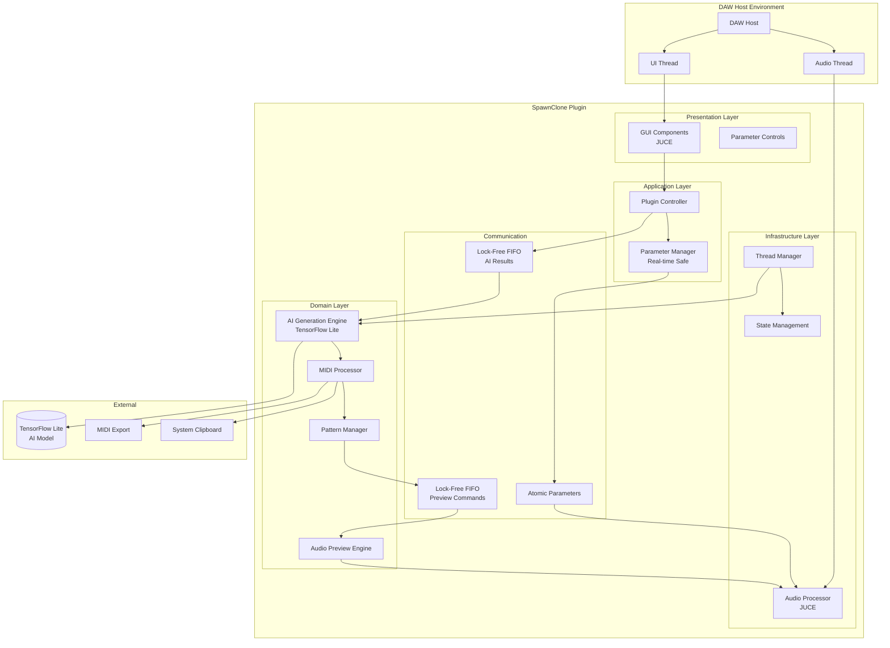
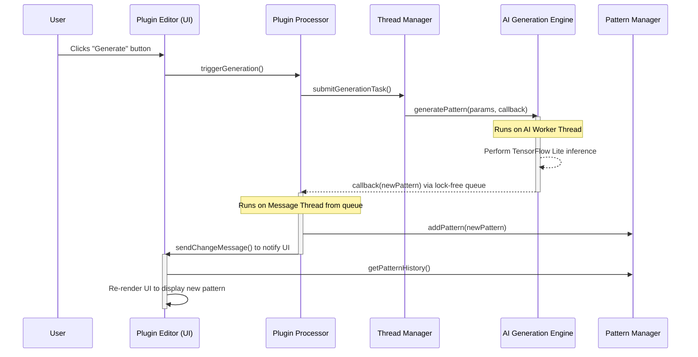
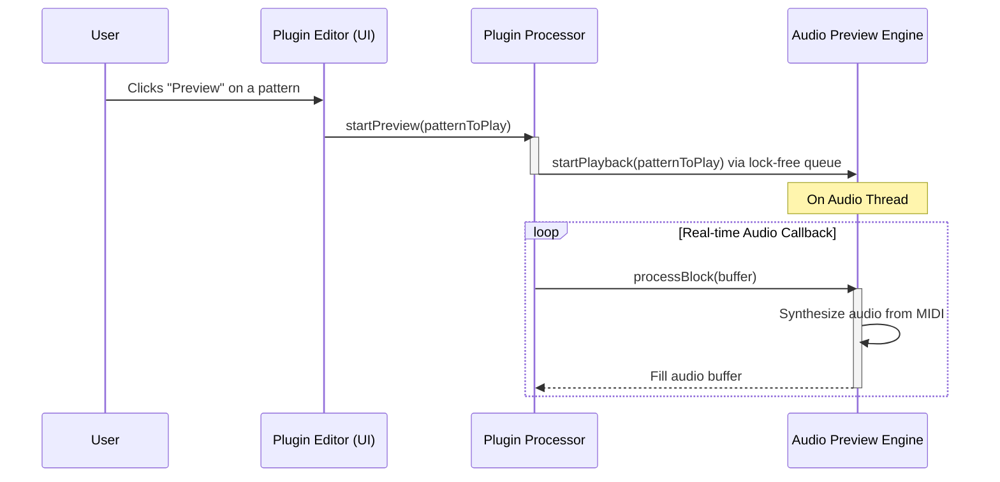
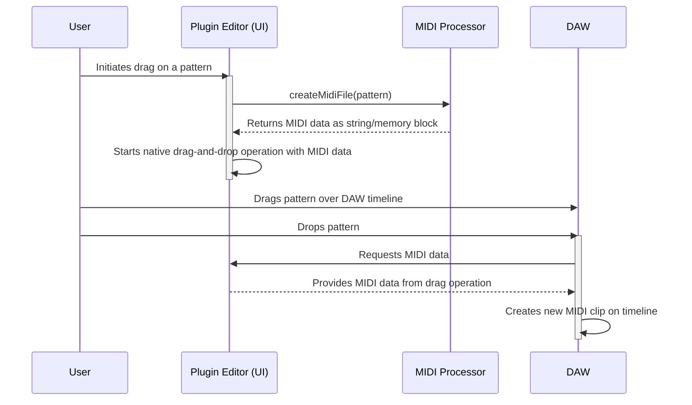

# SpawnClone Architecture Document

## **Introduction**

This document outlines the overall project architecture for **SpawnClone**, including the plugin processor systems, AI generation engine, audio preview components, and platform-specific concerns. Its primary goal is to serve as the guiding architectural blueprint for AI-driven development, ensuring consistency and adherence to chosen patterns and technologies for real-time audio plugin development.

**Project Context:**
SpawnClone is a C++ audio plugin targeting VST3, AudioUnit, and Standalone formats, built with the JUCE 7.x framework and a custom rule-based AI engine for MIDI generation. The architecture must maintain real-time audio safety while delivering sophisticated AI-driven music generation capabilities.

### **Starter Template or Existing Project**

Based on my review of the PRD and technical specification, this project is:

### **N/A - Greenfield JUCE Plugin Project**

This is a custom C++ audio plugin built from scratch using JUCE 7.x framework. While JUCE provides the foundational plugin architecture patterns, the specific AI integration, real-time threading model, and MIDI generation engine are custom implementations designed for this project's unique requirements.

### **Change Log**

| Date | Version | Description | Author |
|------|---------|-------------|--------|
| July 28, 2025 | 1.0 | Initial architecture document creation | Architect Winston |

---

## **High Level Architecture**

### **Technical Summary**

SpawnClone employs a **modular real-time audio plugin architecture** built on the JUCE 7.x framework, featuring strict thread separation between UI, AI generation, and audio processing components. The system utilizes **lock-free communication patterns** to maintain real-time audio safety while integrating a custom rule-based AI engine. The architecture implements a **layered design** with clear separation of concerns: Presentation (JUCE UI), Application (Plugin Controller), Domain (AI Engine, MIDI Processor), and Infrastructure (Audio Processor, Threading). This design directly supports the PRD goals by enabling seamless DAW integration, real-time pattern generation, and drag-and-drop MIDI export while maintaining the required performance constraints (<5% CPU, <32MB memory, <2s generation time).

### **High Level Overview**

**1. Architectural Style:** **Modular Single-Process Plugin Architecture**
- Self-contained audio plugin executable with internally modular components
- Event-driven communication between modules using lock-free patterns
- Strict real-time thread safety with dedicated worker threads for AI processing

**2. Repository Structure:** **Monorepo** (as specified in PRD Technical Assumptions)
- Single repository containing complete plugin codebase, AI models, documentation, and build scripts
- Clear module separation: `/src/core`, `/src/ui`, `/src/ai`, `/src/audio`, `/platform`

**3. Service Architecture:** **Modular Plugin Components** (as specified in PRD)
- **AI Generation Engine**: Background thread processing with a custom rule-based algorithm.
- **Audio Preview Engine**: Real-time audio synthesis and playback.
- **MIDI Processor**: Pattern storage, manipulation, and export.
- **UI Components**: JUCE-based parameter controls and pattern visualization.
- **DAW Integration Layer**: Host communication and plugin format implementation.

**4. Primary User Interaction Flow:**
```
User Parameter Input → UI Thread → Lock-Free FIFO → AI Worker Thread → 
Rule-Based Generation → Generated Pattern → Lock-Free FIFO → 
Audio Thread → Preview Rendering → User Feedback/Export
```

**5. Key Architectural Decisions:**

- **Real-Time Safety First**: All audio-thread code is lock-free and allocation-free.
- **AI Isolation**: The rule-based engine runs on a dedicated worker thread, never blocking audio.
- **JUCE Foundation**: Leverages proven audio plugin framework for cross-platform compatibility.
- **Embedded AI Logic**: Generation algorithms are part of the plugin binary for zero-dependency deployment.
- **Lock-Free Communication**: AbstractFIFO patterns ensure thread safety without blocking.

### **High Level Project Diagram**



### **Architectural and Design Patterns**

- **Layered Architecture:** Clean separation between Presentation, Application, Domain, and Infrastructure layers - *Rationale:* Enables independent testing, clear dependencies, and maintainable code organization for complex audio plugin development

- **Lock-Free Producer-Consumer:** AbstractFIFO patterns for thread communication - *Rationale:* Essential for real-time audio safety; prevents priority inversion and meets NFR6 requirement for no audio dropouts

- **Observer Pattern:** Parameter change notifications and UI updates - *Rationale:* Decouples UI from business logic while enabling real-time parameter visualization and immediate user feedback

- **Strategy Pattern:** Pluggable AI generation algorithms and audio preview instruments - *Rationale:* Supports Epic 4 requirements for multiple generation types (melody/chords/bassline) and future AI model updates

- **Repository Pattern:** Abstracted pattern storage and retrieval - *Rationale:* Enables FR11 session history functionality while supporting future storage backend changes (memory, file, database)

- **Factory Pattern:** Cross-platform plugin format creation (VST3/AU) - *Rationale:* Handles NFR1 requirement for multiple plugin formats while maintaining single codebase

- **RAII (Resource Acquisition Is Initialization):** Memory and resource management - *Rationale:* Critical for audio thread safety and meets memory constraints in NFR4 (<32MB usage)

---

## **Tech Stack**

This section defines the definitive technology stack for the SpawnClone project. All development must adhere to these specific versions to ensure consistency and stability.

### **Technology Stack Table**

| Category | Technology | Version | Purpose | Rationale |
| :--- | :--- | :--- | :--- | :--- |
| **Language** | C++ | C++17 (minimum) | Core programming language | Meets modern performance and feature requirements while maintaining broad compiler support (NFR7). |
| **Core Framework** | JUCE | 7.x | Cross-platform audio plugin development | Provides robust DAW integration, UI components, and audio processing infrastructure (NFR7). |
| **AI Engine** | Custom Rule-Based Engine | 1.0 | On-device MIDI generation | Provides fast, royalty-free, and offline MIDI generation without external dependencies or large model files. |
| **Build System** | CMake | 3.15+ | Cross-platform build configuration | Manages complex builds for Windows, macOS, and Linux from a single source (PRD Assumption). |
| **Plugin Format** | VST3 SDK | 3.7.x | VST3 Plugin Format | Industry-standard plugin format for broad DAW compatibility on all platforms (NFR1). |
| **Plugin Format** | AudioUnit (AU) SDK | CoreAudio | macOS AudioUnit Plugin Format | Native Apple format for seamless integration with Logic Pro and other macOS DAWs (NFR1). |
| **Plugin Format** | Standalone | JUCE | Standalone Application | Allows the application to run outside of a DAW for broader accessibility. |
| **Unit Testing** | GoogleTest | 1.14.x | C++ Unit Testing Framework | Industry standard for writing robust unit tests for core logic and components. |
| **CI/CD** | GitHub Actions | - | Automated builds and testing | Validates builds and runs tests automatically across all target platforms on every commit. |
| **IDE (Recommended)** | Visual Studio 2022 | 17.x | Windows Development | Native C++ toolchain and debugging for Windows. |
| **IDE (Recommended)** | Xcode | 15.x | macOS Development | Native toolchain, AU validation, and debugging for macOS. |
| **IDE (Recommended)** | VS Code | 1.91.x | Linux & Cross-Platform | Flexible editor with excellent CMake and C++ extension support. |

---

## **Data Models**

This section defines the core data structures for SpawnClone. These models are fundamental to how MIDI data is generated, stored, manipulated, and presented to the user.

### **`MIDIPattern`**

**Purpose:** To represent a single, self-contained musical idea as a collection of MIDI notes with associated metadata. This is the primary output of the AI Generation Engine and the core data structure for audio preview, storage, and export.

**Key Attributes:**
- `notes`: A collection of `Note` structs, each containing `pitch`, `velocity`, `startTime`, and `duration`.
- `lengthInBeats`: The total length of the pattern in musical beats (e.g., 16.0 for a 4-bar pattern in 4/4 time).
- `metadata`: A map for storing contextual information like the key, scale, and tempo used for generation.

**Relationships:**
- A `PluginState` contains a history of many `MIDIPattern` objects.
- The `AIGenerationEngine` produces one `MIDIPattern` per generation request.
- The `AudioPreviewEngine` consumes one `MIDIPattern` for playback.

### **`GenerationParameters`**

**Purpose:** To encapsulate all user-configurable settings that guide the AI MIDI generation process. This object is passed to the AI Generation Engine to produce a pattern.

**Key Attributes:**
- `key`: The musical key (e.g., C, G#, etc.).
- `scale`: The musical scale (e.g., Major, Minor, Pentatonic).
- `tempo`: The tempo in beats per minute (BPM).
- `rhythmicComplexity`: A value from 0.0 to 1.0 defining pattern density and syncopation.
- `generationType`: The type of pattern to generate (Melody, Chords, Bassline).

**Relationships:**
- The `UI` layer creates and updates the `GenerationParameters`.
- The `AIGenerationEngine` consumes `GenerationParameters` as input.
- A `MIDIPattern`'s metadata is derived from the `GenerationParameters` used to create it.

### **`PluginState`**

**Purpose:** To represent the complete, serializable state of the plugin instance. This allows the DAW to save and restore the user's session, including all generated patterns and settings.

**Key Attributes:**
- `patternHistory`: A list of `MIDIPattern` objects representing all patterns generated in the session.
- `currentParameters`: The current `GenerationParameters` object reflecting the UI state.
- `uiSettings`: Other UI-related state, like window size and master volume level.

**Relationships:**
- Is the root object for serialization to the DAW host.
- Contains a list of `MIDIPattern`s.
- Contains one `GenerationParameters` object.

---

## **Components**

This section details the major logical components of the SpawnClone plugin. Each component has a distinct responsibility and a well-defined interface, enabling modular development and testing while ensuring the system's overall integrity and real-time performance.

### **Component Diagram**

```mermaid
graph TD
    subgraph "UI Thread"
        Editor[Plugin Editor (UI)]
    end
    
    subgraph "Audio Thread"
        Processor[Plugin Processor]
        AudioPreview[Audio Preview Engine]
    end
    
    subgraph "AI Worker Thread"
        AIEngine[AI Generation Engine]
    end
    
    subgraph "Shared Components"
        ParamMgr[Parameter Manager]
        PatternMgr[Pattern Manager]
        ThreadMgr[Thread Manager]
        MIDIProc[MIDI Processor]
    end
    
    Editor -- User Input --> ParamMgr
    Editor -- Trigger Generation --> Processor
    Processor -- Generation Task --> ThreadMgr
    ThreadMgr -- Dispatches to --> AIEngine
    AIEngine -- Uses --> MIDIProc
    AIEngine -- Returns Pattern --> Processor
    Processor -- Updates --> PatternMgr
    PatternMgr -- Notifies --> Editor
    Editor -- Requests Preview --> Processor
    Processor -- Playback Command --> AudioPreview
    AudioPreview -- Renders Audio --> Processor
    ParamMgr -- Provides Safe Access --> Processor
    ParamMgr -- Provides Safe Access --> AIEngine
```

### **Plugin Processor (`SpawnCloneProcessor`)**
**Responsibility:** The central hub of the plugin. It orchestrates all major operations, manages the audio processing callback, and serves as the primary interface to the DAW host.
**Key Interfaces:**
- `processBlock(AudioBuffer&, MidiBuffer&)`: The real-time audio callback.
- `getStateInformation()` / `setStateInformation()`: For saving/loading plugin state.
- `triggerGeneration()`: Initiates a new AI pattern generation task.
**Dependencies:** `ParameterManager`, `ThreadManager`, `PatternManager`, `AudioPreviewEngine`.
**Technology Stack:** C++, JUCE (`AudioProcessor`).

### **Plugin Editor (`SpawnCloneEditor`)**
**Responsibility:** Manages the entire graphical user interface (GUI). It presents controls to the user, visualizes generated patterns, and communicates user actions to the Plugin Processor.
**Key Interfaces:**
- `paint(Graphics&)`: Renders the UI.
- `resized()`: Handles layout changes.
- `sliderValueChanged()`, `buttonClicked()`: Callbacks for user interactions.
**Dependencies:** `PluginProcessor`, `ParameterManager`.
**Technology Stack:** C++, JUCE (`AudioProcessorEditor`, UI Components).

### **AI Generation Engine**
**Responsibility:** To generate MIDI patterns using a custom rule-based algorithm. This component runs exclusively on a background thread to avoid blocking the audio or UI threads.
**Key Interfaces:**
- `generatePattern(GenerationParameters, callback)`: Asynchronously generates a `MIDIPattern`.
**Dependencies:** `MIDIProcessor`.
**Technology Stack:** C++.

### **Audio Preview Engine**
**Responsibility:** To render a `MIDIPattern` into an audio signal for immediate user feedback. It uses a simple, low-CPU synthesis method.
**Key Interfaces:**
- `processBlock(AudioBuffer&, MidiBuffer&)`: Renders audio for the current preview.
- `startPreview(MIDIPattern)`: Begins playback of a given pattern.
**Dependencies:** `MIDIProcessor`.
**Technology Stack:** C++, JUCE (DSP modules).

### **MIDI Processor**
**Responsibility:** A utility component providing functions for creating, manipulating, and exporting `MIDIPattern` data structures.
**Key Interfaces:**
- `createMidiFile(MIDIPattern)`: Exports a pattern to a standard MIDI file.
- `quantize(MIDIPattern)`: Applies timing correction to a pattern.
**Dependencies:** None.
**Technology Stack:** C++.

### **Parameter Manager**
**Responsibility:** Provides a thread-safe interface to all plugin parameters. It uses atomic values to allow the real-time audio thread to access parameter states without locking.
**Key Interfaces:**
- `getCurrentParameters()`: Returns a `GenerationParameters` struct safely.
- `addParameterListener()`: Allows UI components to react to parameter changes.
**Dependencies:** JUCE (`AudioProcessorValueTreeState`).
**Technology Stack:** C++, JUCE.

### **Thread Manager**
**Responsibility:** Manages the lifecycle of background threads, specifically the AI worker thread. It provides a simple interface for submitting tasks to be run off the main threads.
**Key Interfaces:**
- `submitGenerationTask(task)`: Queues an AI generation task for execution.
**Dependencies:** None.
**Technology Stack:** C++, JUCE (`Thread`).

### **Pattern Manager**
**Responsibility:** Manages the session history of generated `MIDIPattern`s as required by FR11. It handles adding new patterns, deleting old ones, and marking favorites.
**Key Interfaces:**
- `addPattern(MIDIPattern)`: Adds a new pattern to the history.
- `getPatternHistory()`: Returns the list of all generated patterns.
**Dependencies:** `MIDIPattern` data model.
**Technology Stack:** C++.

---

## **Core Workflows**

This section illustrates the primary user and system workflows using sequence diagrams. These diagrams show the interactions between the components defined in the previous section, clarifying the flow of data and control for key features.

### **Workflow 1: AI Pattern Generation and Display**

This workflow describes the process from the user clicking the "Generate" button to the new pattern appearing in the UI.



### **Workflow 2: Pattern Audio Preview**

This workflow shows how a user initiates and hears the audio preview of a generated pattern.



### **Workflow 3: Drag-and-Drop MIDI Export**

This workflow details how a user drags a pattern from the plugin's UI into their DAW.



---

## **Testing Strategy**

A comprehensive testing strategy is crucial to ensure SpawnClone is stable, reliable, and meets all functional and non-functional requirements. The strategy employs a multi-layered approach, from low-level unit tests to high-level manual QA.

### **Unit Testing**

- **Framework:** GoogleTest
- **Scope:** Core, non-UI, and non-audio-thread components.
- **Key Targets:**
  - `MIDIProcessor`: Verify MIDI file creation, quantization, and data manipulation logic.
  - `PatternManager`: Test history management, adding/removing patterns, and state serialization.
  - `ParameterManager`: Ensure thread-safe access and correct parameter mapping.
- **Goal:** Achieve >80% code coverage on all testable utility and data model classes.

### **Component Testing**

- **Framework:** Custom test harnesses using GoogleTest.
- **Scope:** Individual components tested in isolation with mocked dependencies.
- **Key Targets:**
  - `AIGenerationEngine`: Test with mock `GenerationParameters` and validate the structure of the output `MIDIPattern`. Verify behavior with malformed or missing AI model files.
  - `AudioPreviewEngine`: Test with pre-defined `MIDIPattern` objects and analyze the output audio buffer for correctness (e.g., correct frequencies, no glitches).
- **Goal:** Validate the functionality of each major component independently before integration.

### **Integration Testing**

- **Framework:** JUCE's built-in testing utilities and custom test hosts.
- **Scope:** Interactions between major components.
- **Key Scenarios:**
  - **Processor & Editor:** Verify that UI actions (e.g., moving a slider) correctly update the `ParameterManager` and that the Processor reflects these changes.
  - **Full Generation Workflow:** Test the entire chain from `Editor` triggering generation to the `AIEngine` producing a pattern and the `Editor` receiving and displaying it.
- **Goal:** Ensure that components communicate and transfer data correctly.

### **Plugin Validation & QA**

- **Tools:**
  - `auvaltool` (macOS)
  - Steinberg VST3 Plugin Validator
  - DAW-specific validation tools
- **Process:**
  1. **Automated Validation:** CI pipeline runs validation tools on every build to catch format-specific errors.
  2. **Manual DAW Testing:** QA team and beta testers will test the plugin in a range of popular DAWs (Ableton Live, Logic Pro, Reaper, FL Studio) on all target platforms.
  - **Focus:** Test all user-facing features (FR1-FR12), performance (NFR3-NFR6), and DAW compatibility (NFR1-NFR2).
- **Goal:** Guarantee a stable and consistent user experience across all supported environments.

---

## **Deployment and CI/CD**

The deployment process is fully automated using GitHub Actions to ensure consistent, reliable, and signed builds are delivered for each release.

### **CI/CD Pipeline (GitHub Actions)**

A single workflow file (`.github/workflows/build.yml`) will manage the entire process.

1. **Trigger:** On push to `main` or `develop` branches, and on creation of a git tag.
2. **Build Matrix:** The workflow will run jobs in parallel across:
   - `windows-latest` (with Visual Studio 2022)
   - `macos-latest` (with Xcode 15)
   - `ubuntu-latest` (with GCC/Clang)
3. **Steps for each OS:**
   - Check out repository and submodules (JUCE, TensorFlow Lite).
   - Set up C++ environment and CMake.
   - Run CMake to generate build files.
   - Compile the plugin in Release mode.
   - Run all unit and component tests.
   - Run plugin validation tools.
4. **Artifact Generation (on tag):**
   - **macOS:**
     - Build VST3 and AU plugins.
     - Code-sign the bundles using a certificate stored in GitHub Secrets.
     - Notarize the bundles with Apple.
     - Create a `.pkg` installer.
   - **Windows:**
     - Build VST3 plugin.
     - Code-sign the `.dll` and create a `.exe` installer using Inno Setup.
   - Upload installers and signed bundles as build artifacts.
5. **GitHub Release:**
   - When a tag is pushed (e.g., `v1.0.0`), a final step will automatically create a new GitHub Release.
   - The release notes will be populated from the tag's message.
   - The platform-specific installers (`.pkg`, `.exe`) will be attached to the release.

---

## **Future Considerations**

This section outlines potential architectural evolution and feature enhancements for future versions of SpawnClone, ensuring the current design is forward-looking.

- **Advanced AI Models:**
  - The current `Strategy Pattern` for the `AIGenerationEngine` allows for easy integration of new models. Future work could involve exploring more complex architectures like Transformers or VAEs for more nuanced and controllable generation.
- **Cloud-Based Model Delivery:**
  - An optional feature could allow the plugin to check for and download updated or alternative AI models from a secure cloud backend (e.g., Azure Blob Storage). This would require adding networking capabilities and careful security considerations.
- **Expanded Instrument Library:**
  - The `AudioPreviewEngine` could be enhanced to support a library of different synthesizer presets or simple sample-based instruments, giving users more variety in how they preview patterns.
- **UI/UX Enhancements:**
  - Future versions could incorporate more advanced data visualization for the generated MIDI, such as a piano roll with animation. This may require leveraging JUCE's OpenGL or Metal rendering capabilities for better performance.
- **API for Scripting:**
  - Exposing a Lua or Python scripting API could allow power users to programmatically interact with the generation engine, creating complex musical structures and custom workflows.
