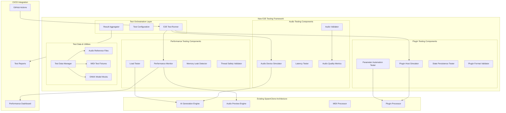

# SpawnClone End-to-End Testing Architecture

**Project:** SpawnClone AI MIDI Pattern Generator  
**Enhancement:** End-to-End Testing Infrastructure  
**Version:** 1.0  
**Date:** August 6, 2025  
**Status:** Ready for Implementation  

---

## **Introduction**

This document outlines the architectural approach for enhancing SpawnClone with **comprehensive end-to-end testing infrastructure**. Its primary goal is to serve as the guiding architectural blueprint for implementing production-ready testing that validates the complete audio processing pipeline from MIDI generation through real-time audio output.

**Relationship to Existing Architecture:**
This document supplements the existing SpawnClone architecture by defining how E2E testing components will integrate with current JUCE-based systems. The testing infrastructure leverages existing GoogleTest framework, CMake build patterns, and JUCE audio components while adding specialized audio validation capabilities.

---

## **Existing Project Analysis**

### **Current Architecture Strengths**

Based on analysis of existing documentation and source structure:

✅ **Solid Foundation:**
- **JUCE 8.x Framework** - Professional audio plugin development platform
- **CMake Build System** - Comprehensive build targets with existing GoogleTest integration  
- **Modular Architecture** - Clear separation: AI Engine, Audio Preview, MIDI Processing, UI
- **Real-time Safety** - Lock-free communication patterns and thread separation
- **Existing Testing** - GoogleTest infrastructure with multiple test targets already configured

✅ **Current Testing Infrastructure:**
- **GoogleTest Integration** - 15+ existing test targets with `gtest_discover_tests()` pattern
- **Test Categories** - Audio, Performance, Advanced Generation, Pattern Evolution
- **Build Integration** - Tests integrated into CMake build with automatic discovery
- **Threading Tests** - Performance and real-time validation already established

### **Identified E2E Testing Gaps**

❌ **Missing E2E Validation:**
- **Complete Workflow Testing** - No full MIDI generation → audio output → export validation
- **Cross-Platform Integration** - No automated testing across macOS/Windows/Linux
- **Plugin Host Simulation** - No DAW environment simulation for VST3/AU testing
- **Performance Regression** - No automated performance baseline validation
- **Audio Quality Validation** - No automated audio artifact detection

### **Integration Opportunities**

🎯 **Leverage Existing Patterns:**
- **Extend GoogleTest Framework** - Build upon existing test infrastructure
- **Follow CMake Patterns** - Use established `gtest_discover_tests()` approach
- **Utilize JUCE Components** - Leverage AudioPreviewEngine, MIDIProcessor for testing
- **Thread-Safe Patterns** - Apply existing lock-free communication for test scenarios

---

## **Technical Architecture Overview**

### **High-Level E2E Testing Architecture**



### **Architecture Layers**

#### **1. Test Orchestration Layer**
**Purpose:** Coordinate and manage E2E test execution across all components

**Components:**
- **E2E Test Runner** - Central coordinator for test suite execution
- **Test Configuration** - Environment and scenario configuration management
- **Result Aggregator** - Collection and analysis of test results across components

#### **2. Audio Testing Components** 
**Purpose:** Validate complete audio processing pipeline and quality

**Components:**
- **Audio Device Simulator** - Simulates various audio hardware configurations
- **Audio Validator** - Automated analysis of generated audio content
- **Latency Tester** - Validates real-time audio latency requirements (<10ms)
- **Audio Quality Metrics** - THD+N, frequency response, and artifact detection

#### **3. Plugin Testing Components**
**Purpose:** Validate plugin behavior across different host environments

**Components:**
- **Plugin Host Simulator** - Simulates DAW environments (Logic, Pro Tools, Ableton)
- **Parameter Automation Tester** - Validates parameter changes and automation
- **State Persistence Tester** - Tests plugin state save/recall functionality
- **Plugin Format Validator** - VST3/AU compliance and compatibility testing

#### **4. Performance Testing Components**
**Purpose:** Validate performance characteristics and resource usage

**Components:**
- **Performance Monitor** - Real-time performance metrics collection
- **Load Tester** - Stress testing with multiple concurrent operations
- **Memory Leak Detector** - Extended operation memory validation
- **Thread Safety Validator** - Concurrency and thread safety validation

#### **5. Test Data & Utilities**
**Purpose:** Provide test fixtures, reference data, and utilities

**Components:**
- **Test Data Manager** - Centralized test data and fixture management
- **Audio Reference Files** - Curated reference audio for comparison
- **MIDI Test Fixtures** - Comprehensive MIDI test patterns
- **ONNX Model Mocks** - Test models for AI validation scenarios

---

## **Integration with Existing System**

### **CMake Integration Pattern**

**Following Existing Pattern:**
```cmake
# New E2E Test Target (follows existing gtest pattern)
add_executable(test_E2E_AudioPipeline
    tests/e2e/test_audio_pipeline.cpp
    tests/e2e/audio_test_utilities.cpp
    tests/e2e/audio_device_simulator.cpp
    tests/e2e/audio_validator.cpp
)

target_link_libraries(test_E2E_AudioPipeline PRIVATE
    SpawnClone_Static      # Link to existing plugin components
    gtest_main             # Existing GoogleTest integration
    juce::juce_audio_devices
    juce::juce_dsp
)

gtest_discover_tests(test_E2E_AudioPipeline)
```

**E2E Test Organization:**
```
tests/
├── e2e/                           # New E2E tests directory
│   ├── audio/                     # Audio pipeline tests
│   │   ├── test_audio_pipeline.cpp
│   │   ├── test_latency.cpp
│   │   └── test_audio_quality.cpp
│   ├── plugin/                    # Plugin compatibility tests
│   │   ├── test_vst3_host.cpp
│   │   ├── test_au_host.cpp
│   │   └── test_parameter_automation.cpp
│   ├── performance/               # Performance tests
│   │   ├── test_load.cpp
│   │   ├── test_memory.cpp
│   │   └── test_threading.cpp
│   ├── integration/               # Full workflow tests
│   │   ├── test_midi_to_audio.cpp
│   │   └── test_onnx_integration.cpp
│   └── utilities/                 # E2E test utilities
│       ├── audio_test_utilities.cpp
│       ├── plugin_host_simulator.cpp
│       └── test_data_manager.cpp
├── unit/                          # Existing unit tests (unchanged)
└── integration/                   # Existing integration tests (unchanged)
```

### **Leveraging Existing Components**

**Audio Testing Integration:**
```cpp
// Build upon existing AudioPreviewEngine
class AudioPipelineE2ETest : public ::testing::Test {
protected:
    void SetUp() override {
        // Use existing AudioPreviewEngine
        audioEngine = std::make_unique<AudioPreviewEngine>();
        audioEngine->initialize(44100, 512);
        
        // Add E2E testing capabilities
        audioValidator = std::make_unique<AudioValidator>();
        latencyTester = std::make_unique<LatencyTester>();
    }
    
    std::unique_ptr<AudioPreviewEngine> audioEngine;
    std::unique_ptr<AudioValidator> audioValidator;
    std::unique_ptr<LatencyTester> latencyTester;
};
```

**ONNX Integration Testing:**
```cpp
// Build upon existing ONNXModelManager
class ONNXIntegrationE2ETest : public ::testing::Test {
protected:
    void SetUp() override {
        // Use existing ONNX infrastructure
        modelManager = std::make_unique<ONNXModelManager>();
        
        // Add E2E testing models and validation
        testModelLoader = std::make_unique<TestModelLoader>();
        aiValidator = std::make_unique<AIOutputValidator>();
    }
    
    std::unique_ptr<ONNXModelManager> modelManager;
    std::unique_ptr<TestModelLoader> testModelLoader;
    std::unique_ptr<AIOutputValidator> aiValidator;
};
```

---

## **Core E2E Testing Components**

### **1. Audio Pipeline Validator**

**Purpose:** Validate complete MIDI → Audio processing chain

**Key Features:**
- **End-to-End Flow Testing** - MIDI generation through audio output validation
- **Real-time Performance** - Latency measurement and validation
- **Audio Quality Analysis** - Automated detection of audio artifacts
- **Cross-platform Consistency** - Identical audio output across platforms

**Architecture:**
```cpp
class AudioPipelineValidator {
public:
    struct ValidationResult {
        bool passed;
        double latencyMs;
        double thdPlusN;
        std::vector<QString> issues;
        AudioMetrics metrics;
    };
    
    ValidationResult validateCompleteFlow(
        const GenerationParameters& params,
        const MIDIPattern& expectedPattern
    );
    
private:
    std::unique_ptr<AudioDeviceSimulator> deviceSim_;
    std::unique_ptr<AudioQualityAnalyzer> qualityAnalyzer_;
    std::unique_ptr<LatencyMeasurer> latencyMeasurer_;
};
```

### **2. Plugin Host Simulator**

**Purpose:** Simulate various DAW environments for plugin testing

**Key Features:**
- **DAW Environment Simulation** - Logic, Pro Tools, Ableton behavior patterns
- **Parameter Automation** - Automated parameter change testing
- **State Persistence** - Save/recall testing across sessions
- **Format Compliance** - VST3/AU specification validation

**Architecture:**
```cpp
class PluginHostSimulator {
public:
    enum class HostType {
        LogicPro,
        ProTools,
        AbletonLive,
        StudioOne,
        Generic
    };
    
    struct HostTestResult {
        bool compatible;
        std::vector<QString> incompatibilities;
        ParameterTestResults paramResults;
        StateTestResults stateResults;
    };
    
    HostTestResult testPluginCompatibility(HostType host);
    
private:
    std::unique_ptr<DAWBehaviorEmulator> dawEmulator_;
    std::unique_ptr<ParameterAutomationTester> paramTester_;
    std::unique_ptr<StatePersistenceTester> stateTester_;
};
```

### **3. Performance Monitor**

**Purpose:** Monitor and validate performance characteristics

**Key Features:**
- **Real-time Metrics** - CPU usage, memory consumption, audio thread performance
- **Load Testing** - Performance under various stress conditions
- **Regression Detection** - Automated performance baseline comparison
- **Threading Validation** - Thread safety and concurrency testing

**Architecture:**
```cpp
class PerformanceMonitor {
public:
    struct PerformanceMetrics {
        double cpuUsagePercent;
        size_t memoryUsageMB;
        double audioThreadLatencyMs;
        int audioDropouts;
        std::chrono::milliseconds generationTimeMs;
    };
    
    PerformanceMetrics runLoadTest(
        int concurrentInstances,
        std::chrono::minutes duration
    );
    
    bool detectPerformanceRegression(
        const PerformanceMetrics& current,
        const PerformanceMetrics& baseline
    );
    
private:
    std::unique_ptr<CPUMonitor> cpuMonitor_;
    std::unique_ptr<MemoryMonitor> memoryMonitor_;
    std::unique_ptr<AudioThreadMonitor> audioThreadMonitor_;
};
```

---

## **Testing Data Management**

### **Test Data Architecture**

**Test Data Organization:**
```
tests/data/
├── audio/
│   ├── reference/                 # Reference audio files for comparison
│   │   ├── hip_hop_reference.wav
│   │   ├── edm_reference.wav
│   │   └── pop_reference.wav
│   ├── test_signals/              # Test signals for audio validation
│   │   ├── sine_waves/
│   │   ├── noise/
│   │   └── complex_signals/
│   └── corrupted/                 # Corrupted files for error testing
├── midi/
│   ├── patterns/                  # Test MIDI patterns
│   │   ├── simple_patterns/
│   │   ├── complex_patterns/
│   │   └── edge_cases/
│   ├── sequences/                 # Full MIDI sequences
│   └── malformed/                 # Malformed MIDI for error testing
├── onnx/
│   ├── test_models/               # Lightweight test models
│   │   ├── simple_model.onnx
│   │   └── complex_model.onnx
│   ├── mock_models/               # Mock models for specific tests
│   └── corrupted_models/          # Corrupted models for error testing
└── presets/
    ├── test_presets/              # Test instrument presets
    └── validation_presets/        # Presets for output validation
```

### **Test Data Manager**

```cpp
class TestDataManager {
public:
    static TestDataManager& getInstance();
    
    // Audio test data
    juce::File getAudioReference(const QString& category, const QString& name);
    juce::File getTestSignal(const QString& type);
    
    // MIDI test data  
    MIDIPattern getTestPattern(const QString& complexity, const QString& genre);
    juce::File getMIDISequence(const QString& name);
    
    // ONNX test models
    juce::File getTestModel(const QString& type);
    juce::File getMockModel(const QString& scenario);
    
    // Preset test data
    InstrumentPreset getTestPreset(const QString& instrument);
    
private:
    juce::File testDataRoot_;
    std::unordered_map<QString, juce::File> cachedFiles_;
};
```

---

## **CI/CD Integration Architecture**

### **GitHub Actions Integration**

**E2E Test Workflow:**
```yaml
name: E2E Testing Pipeline

on:
  push:
    branches: [ main, develop ]
  pull_request:
    branches: [ main ]

jobs:
  e2e-tests:
    strategy:
      matrix:
        os: [macos-latest, windows-latest, ubuntu-latest]
        
    runs-on: ${{ matrix.os }}
    
    steps:
    - uses: actions/checkout@v3
    
    - name: Setup Audio Environment
      run: |
        # Install audio drivers/dependencies per platform
        # Setup virtual audio devices for testing
        
    - name: Build with E2E Tests
      run: |
        cmake -B build -DBUILD_E2E_TESTS=ON
        cmake --build build --config Release
        
    - name: Run E2E Audio Pipeline Tests
      run: ctest --test-dir build -R "test_E2E_Audio*" --verbose
      
    - name: Run E2E Plugin Tests  
      run: ctest --test-dir build -R "test_E2E_Plugin*" --verbose
      
    - name: Run E2E Performance Tests
      run: ctest --test-dir build -R "test_E2E_Performance*" --verbose
      
    - name: Generate Performance Report
      run: build/test_performance_reporter --output performance-${{ matrix.os }}.json
      
    - name: Upload Test Results
      uses: actions/upload-artifact@v3
      with:
        name: e2e-test-results-${{ matrix.os }}
        path: |
          build/test-results/
          performance-${{ matrix.os }}.json
```

### **Performance Regression Detection**

```cpp
class PerformanceRegressionDetector {
public:
    struct RegressionReport {
        bool hasRegression;
        std::vector<PerformanceIssue> issues;
        PerformanceComparison comparison;
    };
    
    RegressionReport compareWithBaseline(
        const PerformanceMetrics& current,
        const QString& baselineBranch = "main"
    );
    
private:
    struct PerformanceBaseline {
        PerformanceMetrics metrics;
        QString gitCommit;
        std::chrono::system_clock::time_point timestamp;
    };
    
    PerformanceBaseline loadBaseline(const QString& branch);
    void saveBaseline(const PerformanceMetrics& metrics, const QString& branch);
};
```

---

## **Implementation Phases**

### **Phase 1: Core E2E Framework (4 weeks)**

**Week 1-2: Foundation**
- Set up E2E test directory structure following existing CMake patterns
- Implement basic Audio Pipeline Validator
- Create Test Data Manager with initial test assets
- Integrate with existing GoogleTest infrastructure

**Week 3-4: Audio Testing**
- Implement Audio Device Simulator
- Create Audio Quality Metrics analyzer
- Develop Latency Testing framework
- Add first complete MIDI → Audio validation tests

### **Phase 2: ONNX & AI Testing (3 weeks)**

**Week 5-6: AI Integration**  
- Implement ONNX Model test fixtures and mocks
- Create AI Output Validator for pattern validation
- Add performance testing for model inference
- Test fallback behaviors and error conditions

**Week 7: Advanced Scenarios**
- Multi-model testing scenarios
- Model switching under load
- Memory management validation
- AI coherence validation

### **Phase 3: Plugin Compatibility (4 weeks)**

**Week 8-9: Host Simulation**
- Implement Plugin Host Simulator framework
- Create DAW-specific behavior emulation
- Add VST3/AU compliance testing
- Parameter automation testing

**Week 10-11: Cross-Platform**
- macOS/Windows/Linux compatibility validation
- Platform-specific audio driver testing
- Plugin format validation across platforms
- State persistence across platforms

### **Phase 4: Performance & CI/CD (3 weeks)**

**Week 12-13: Performance Framework**
- Complete Performance Monitor implementation
- Load testing with multiple instances
- Memory leak detection over extended periods
- Thread safety validation under stress

**Week 14: CI/CD Integration**
- GitHub Actions workflow implementation
- Performance regression detection
- Automated test reporting
- Cross-platform test result aggregation

### **Phase 5: Documentation & Training (2 weeks)**

**Week 15-16: Documentation**
- Comprehensive E2E testing documentation
- Developer guides for extending test scenarios
- CI/CD troubleshooting guides
- Team onboarding materials

---

## **Success Metrics & Validation**

### **Technical Success Criteria**

**Framework Capability:**
- ✅ **100% Audio Workflow Coverage** - Complete MIDI generation → audio output validation
- ✅ **Sub-10ms Latency Validation** - Consistent real-time audio performance verification
- ✅ **Cross-Platform Consistency** - Identical behavior across macOS/Windows/Linux
- ✅ **Plugin Compatibility** - Major DAW compatibility automatically validated

**Integration Success:**
- ✅ **Seamless CMake Integration** - E2E tests follow existing build patterns
- ✅ **Existing Test Preservation** - All current tests continue to function
- ✅ **Developer Workflow** - E2E tests integrated into development process
- ✅ **CI/CD Automation** - Complete pipeline automation with performance gates

**Performance Validation:**
- ✅ **Test Execution Time** - Complete E2E suite < 15 minutes
- ✅ **Resource Efficiency** - Tests consume < 4GB RAM, < 80% CPU
- ✅ **Regression Detection** - Automated performance baseline comparison
- ✅ **Test Stability** - < 1% false positive rate across scenarios

### **Operational Success Criteria**

**Team Adoption:**
- ✅ **Developer Usage** - E2E tests used for feature validation
- ✅ **Quality Gates** - E2E tests prevent production regressions
- ✅ **Performance Monitoring** - Continuous performance validation
- ✅ **Documentation** - Comprehensive guides enable test extension

**Production Confidence:**
- ✅ **95% Deployment Confidence** - Comprehensive automated validation
- ✅ **Zero Critical Issues** - E2E coverage prevents production problems
- ✅ **Performance Assurance** - Real-time audio performance guaranteed
- ✅ **Cross-Platform Reliability** - Consistent behavior validation

---

## **Next Steps**

1. **Epic Planning** - Break down architecture into implementable stories
2. **Foundation Setup** - Establish core E2E testing infrastructure
3. **Audio Pipeline Implementation** - Begin with Epic 1 (Audio Pipeline Testing)
4. **Progressive Integration** - Incrementally add each Epic to CI/CD
5. **Team Onboarding** - Training and documentation for E2E framework usage

---

**Architecture Status: ✅ COMPLETE - Ready for Epic Planning and Implementation**

This architecture provides a comprehensive foundation for implementing end-to-end testing that will ensure production-ready quality for SpawnClone across all critical workflows and integration points while seamlessly integrating with existing JUCE/CMake/GoogleTest infrastructure.
