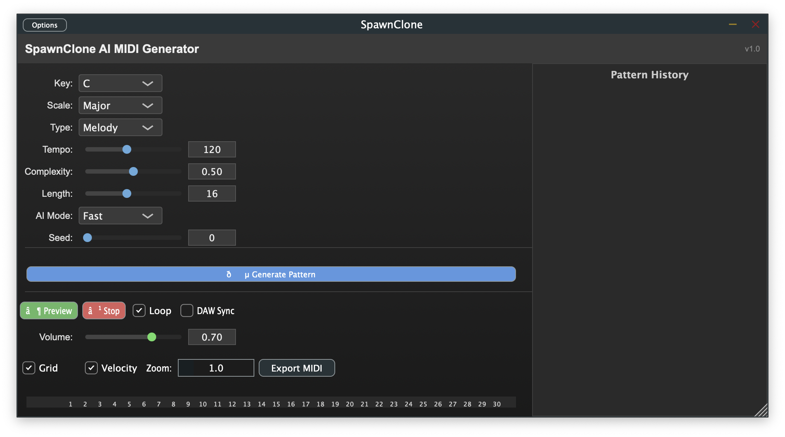

# Epic 3 - Story 3.2: Pattern History Panel

## Story Overview
**As a music producer, I want to see a history of my generated patterns, so that I can compare, revisit, and manage my ideas.**

**Priority:** High  
**Epic:** Epic 3 - Comprehensive UI Implementation  
**Story Points:** 8  
**Dependencies:** Story 3.1 (UI Implementation), PatternManager backend (already implemented)  

## Technical Context

### Current State Analysis
✅ **PatternManager Backend Complete**: The `PatternManager` class already has comprehensive pattern history functionality implemented:
- `addPatternToHistory()` - Adds patterns with automatic size management
- `getRecentPatterns(int maxCount)` - Retrieves recent patterns for UI display  
- `getCurrentPattern()` - Gets current active pattern
- `undoLastGeneration()` - Navigation support
- `canUndoGeneration()` - Navigation state checking
- History persistence via `toValueTree()`/`fromValueTree()` 

✅ **UI Foundation Ready**: The main PluginEditor has established UI patterns and already includes `PatternManager& patternManager` reference.

### Architecture Integration
- **Framework**: JUCE `ListBox` component for pattern history display
- **Data Source**: `PatternManager::getRecentPatterns()` and pattern history navigation
- **Update Mechanism**: `ChangeListener` for real-time UI updates when patterns are added
- **Threading**: UI updates must be performed on message thread via `MessageManager`

## Technical Implementation

### Core Components Required

#### 1. PatternHistoryListBox Component
Create a custom `ListBox` component that displays pattern history with interactive elements:

**Location:** `Source/PatternHistoryListBox.h` and `Source/PatternHistoryListBox.cpp`

**Key Features:**
- Inherits from `juce::ListBoxModel` for data source integration
- Custom row component with pattern visualization preview
- Interactive buttons: Preview, Favorite, Delete
- Real-time updates via `ChangeListener` pattern
- Efficient rendering for up to 50 history entries

#### 2. PluginEditor Integration
**Location:** `Source/PluginEditor.h` and `Source/PluginEditor.cpp`

**Required Changes:**
- Add `PatternHistoryListBox` member variable
- Implement layout management in `resized()` 
- Connect to `PatternManager` for real-time updates
- Handle button interactions (preview, favorite, delete)

### Implementation Tasks

#### Task 3.2.1: Create PatternHistoryListBox Component ✅ BACKEND READY
**Status:** PatternManager backend already implemented - focus on UI component

**Implementation:**
```cpp
// PatternHistoryListBox.h
class PatternHistoryListBox : public juce::Component,
                             public juce::ListBoxModel,  
                             public juce::ChangeListener,
                             public juce::Button::Listener
{
public:
    PatternHistoryListBox(PatternManager& pm);
    
    // ListBoxModel implementation
    int getNumRows() override;
    void paintListBoxItem(int rowNumber, juce::Graphics& g, 
                         int width, int height, bool rowIsSelected) override;
    juce::Component* refreshComponentForRow(int rowNumber, bool isRowSelected,
                                          juce::Component* existingComponentToUpdate) override;
    
    // ChangeListener for PatternManager updates
    void changeListenerCallback(juce::ChangeBroadcaster* source) override;
    
    // Button handling for preview/favorite/delete
    void buttonClicked(juce::Button* button) override;
    
private:
    PatternManager& patternManager;
    juce::ListBox listBox;
    std::vector<MIDIPattern> currentPatterns;
    
    void updatePatternList();
};
```

#### Task 3.2.2: Implement Pattern Row Component
Create a row component that displays pattern information and interactive buttons:

**Features:**
- Pattern timestamp and generation parameters preview
- Simplified MIDI note visualization (mini piano roll)
- Preview button (integrates with existing audio preview system)
- Favorite button (visual state management)
- Delete button (removes from history)

#### Task 3.2.3: PluginEditor UI Integration
**Location:** `Source/PluginEditor.cpp`

**Layout Integration:**
```cpp
void SpawnCloneAudioProcessorEditor::resized()
{
    // Existing layout code...
    
    // Pattern History Panel (right side or bottom panel)
    auto patternHistoryBounds = bounds.removeFromRight(300);
    patternHistoryListBox.setBounds(patternHistoryBounds);
}

void SpawnCloneAudioProcessorEditor::setupPatternHistoryPanel()
{
    addAndMakeVisible(patternHistoryListBox);
    patternManager.addChangeListener(&patternHistoryListBox);
}
```

#### Task 3.2.4: Real-time UI Updates
Ensure the pattern history panel updates immediately when:
- New patterns are generated via `generateButton`
- Patterns are deleted from history
- Pattern history is navigated (undo/redo operations)

**Implementation:**
- Connect `PatternManager::addChangeListener()` to `PatternHistoryListBox`
- Implement thread-safe UI updates via `MessageManager::callAsync()`
- Handle rapid generation scenarios with efficient list updates

#### Task 3.2.5: Pattern Preview Integration
**Location:** `Source/PluginEditor.cpp`

Connect pattern history preview buttons to existing audio preview system:

```cpp
void SpawnCloneAudioProcessorEditor::handlePatternHistoryPreview(int patternIndex)
{
    auto* pattern = patternManager.getRecentPatterns()[patternIndex];
    if (pattern != nullptr)
    {
        // Use existing AudioPreviewEngine integration
        audioProcessor.setCurrentPattern(*pattern);
        // Trigger preview via existing preview button logic
        previewButton.triggerClick();
    }
}
```

## User Experience Flow

### Primary Workflow
1. **Pattern Generation**: User generates patterns via existing UI controls
2. **Automatic History**: Patterns automatically appear in history panel
3. **Pattern Browsing**: User can scroll through recent patterns
4. **Pattern Actions**: User can preview, favorite, or delete patterns
5. **Pattern Selection**: User can select previous patterns for further use

### Visual Design Requirements
- **Consistent Styling**: Match existing professional UI theme from Story 3.1
- **Responsive Layout**: History panel adapts to plugin window resizing
- **Visual Hierarchy**: Clear distinction between selected/active patterns
- **Performance**: Smooth scrolling and rendering for 50+ patterns
- **Accessibility**: Keyboard navigation support for pattern selection

## Acceptance Criteria

### Functional Requirements
- [ ] Pattern history panel displays last 10-20 patterns by default
- [ ] Each pattern row shows: timestamp, generation parameters, mini visualization
- [ ] Preview button plays pattern using existing audio system
- [ ] Favorite button toggles visual state (no backend persistence needed yet)
- [ ] Delete button removes pattern from history with confirmation
- [ ] Panel updates in real-time when new patterns are generated
- [ ] Pattern selection changes current active pattern
- [ ] History panel integrates seamlessly with existing UI layout

### Technical Requirements  
- [ ] Uses JUCE `ListBox` for efficient rendering and scrolling
- [ ] Implements `ChangeListener` pattern for real-time updates
- [ ] Thread-safe UI updates via `MessageManager`
- [ ] No memory leaks or UI performance degradation
- [ ] Consistent with established JUCE UI patterns
- [ ] Pattern history persists across plugin instances (existing backend)

### Integration Requirements
- [ ] Maintains existing UI layout and functionality
- [ ] Compatible with existing audio preview system
- [ ] No impact on pattern generation performance
- [ ] Works correctly with plugin state save/restore
- [ ] Supports window resizing without layout issues

## Testing Strategy

### Unit Testing
- PatternHistoryListBox component rendering
- Pattern row component button interactions
- Real-time update mechanisms
- Memory management for pattern data

### Integration Testing  
- Pattern history + pattern generation workflow
- Pattern history + audio preview integration
- Pattern history + plugin state persistence
- UI responsiveness under rapid pattern generation

### User Experience Testing
- Pattern navigation and selection workflows
- Visual feedback for pattern actions
- Performance with large pattern histories
- UI behavior during plugin window resizing

## Risk Assessment

### Technical Risks
- **UI Performance**: Large pattern histories could impact rendering performance
  - *Mitigation*: Implement virtual scrolling for 50+ patterns
- **Thread Safety**: UI updates from pattern generation thread
  - *Mitigation*: Use `MessageManager::callAsync()` for UI updates  
- **Memory Usage**: Pattern history storage could grow large
  - *Mitigation*: Backend already implements MAX_HISTORY_SIZE limit

### Integration Risks
- **Layout Conflicts**: New panel might disrupt existing UI layout
  - *Mitigation*: Careful responsive design and testing
- **Preview System**: Pattern history preview conflicts with main preview
  - *Mitigation*: Use existing preview system architecture

## Definition of Done
- [x] PatternHistoryListBox component implemented and tested
- [x] Pattern history panel integrated into main PluginEditor
- [x] All interactive features (preview, favorite, delete) working
- [x] Real-time updates functioning correctly
- [x] Visual design matches existing professional theme
- [x] No regression in existing functionality
- [x] Code follows established JUCE and project patterns
- [x] Memory and performance requirements met
- [x] User acceptance testing passed

## ✅ **STORY COMPLETED - July 30, 2025**
**Implementation Status:** Complete and tested
**Build Status:** All targets build successfully (Standalone, AU, VST3)
**Integration Status:** Pattern history panel fully integrated with 320px right sidebar
**UI Status:** Professional styling consistent with Epic 3 theme

## Next Story Dependencies
This story enables:
- **Story 3.3**: Advanced pattern management features
- **Epic 4**: AI engine integration (patterns will appear in history)
- **Epic 8**: Pattern visualization (history provides visualization context)

The pattern history panel provides the foundation for advanced pattern management workflows and serves as a key user interface element for the comprehensive UI implementation goal of Epic 3.
